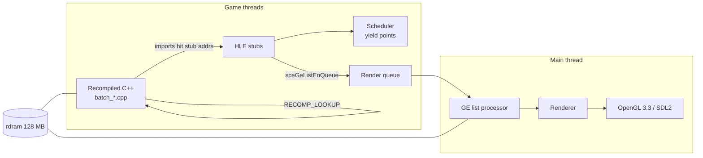

# Architecture

Structural reference for psprecomp. For project status, build instructions, and limitations,
see [README.md](README.md).

## Contents

- [System Overview](#system-overview)
- [Rust Crates](#rust-crates)
- [Generated Output Layout](#generated-output-layout)
- [Runtime Subsystems](#runtime-subsystems)
- [Key Data Flow](#key-data-flow)
- [Invariants and Conventions](#invariants-and-conventions)

## System Overview

Two halves: a Rust recompilation pipeline (offline) and a C++17 runtime (online).

1. **Analyze** — Ghidra headless (`analysis/ExtractAnalysis.java`) exports functions, xrefs, and
   mid-function entry points; the Rust ELF parser adds imports (NIDs), relocations, and section
   data. Merged into `analysis.json` (all addresses as hex strings).
2. **Recompile** — each guest function is decoded into a typed IR and emitted as a C++ function;
   batches are emitted in parallel (rayon). Output also includes the dispatch table, data
   sections, and mid-entry wrappers.
3. **Run** — the generated code is compiled into the runtime, which supplies guest memory, a
   cooperative scheduler, HLE stubs for the firmware imports, and the GE→OpenGL renderer.

## Rust Crates

All under `crates/`:

| Crate | Responsibility |
|-------|----------------|
| `psp-parser` | ELF/PRX parsing, NID database, relocations (goblin 0.9.3) |
| `psp-ir` | `MipsOp` enum, `DecodedFunction` — typed IR for all Allegrex + FPU instructions |
| `psp-decoder` | MIPS32 + Allegrex + FPU instruction decoding, two-pass delay-slot reordering |
| `psp-optimizer` | Peephole passes; all disabled by default (`OptimizerConfig::default()` all false) |
| `psp-emitter` | C++ code generation, batch emission (rayon), dispatch table, generated CMakeLists |
| `psp-cli` | `psprecomp` binary with `analyze`, `recompile`, `dump` subcommands |

## Generated Output Layout

`psprecomp recompile` writes to `output/` (gitignored; always regenerated, never hand-edited):

| Path | Contents |
|------|----------|
| `generated/batch_*.cpp` | Per-batch function translations |
| `dispatch.cpp` | Address-to-function dispatch table |
| `data_sections.cpp` | `.data`/`.rodata`/`.bss` as byte arrays (addresses masked with `0x07FFFFFFU`) |
| `init_array.cpp` | Static-constructor pointer table (not walked by default — the game's CRT handles it) |
| `mid_entries.cpp` | Mid-function entry point wrappers |
| `funcs.h` | Forward declarations for all generated functions |
| `include/recomp.h` | `recomp_context` struct, register aliases, memory macros, `RECOMP_LOOKUP` declaration |
| `CMakeLists.txt` | Generated build fragment — globs `batch_*.cpp` only |

Every recompiled function has the signature
`void(uint8_t* rdram, recomp_context* ctx)` (`FuncPtr` in `recomp.h`). The FPU register file in
`recomp_context` exposes `float f[32]` and `uint32_t fi[32]` as aliasing views of the same
storage via an anonymous union.

## Runtime Subsystems

All under `runtime/` (headers in `runtime/include/`, sources in `runtime/src/`):

| Subsystem | Files | Responsibility |
|-----------|-------|----------------|
| Boot / main loop | `main.cpp` | Boot sequence (module start, thread creation), SDL2 main loop |
| Memory | `psp_memory.cpp` | 128 MB `rdram` allocation; all guest addresses masked with `0x07FFFFFFU` |
| Dispatch | `psp_dispatch.cpp` | `RECOMP_LOOKUP` address→function resolution; miss handler; `PSPRECOMP_STRICT` abort mode |
| Scheduler | `psp_scheduler.cpp` | Cooperative threading (`PspThread`, yield points); `thread_local PspThread* g_current` |
| HLE | `src/hle/psp_hle_*.cpp` | Firmware NID implementations: io, kernel (thread/sema/mutex/eventflag/memory), display, ge, ctrl, power, utility; name-based registration wired to stub addresses via dispatch overrides |
| GE list processor | `psp_ge.cpp` | Display-list interpretation, including SIGNAL flow-control behaviors 0x10–0x12 (JUMP/CALL/RET) |
| Renderer | `psp_ge_draw.cpp`, `psp_ge_vertex.cpp`, `psp_ge_texture.cpp`, `psp_ge_shader.cpp` | Vertex decode/transform (column-major PSP matrices), CLUT/texture decode, shaders, GL draw — deep-dive in [docs/GRAPHICS.md](docs/GRAPHICS.md) |
| Render queue | `psp_render_queue.cpp` | Condvar request queue — the only path by which GL work reaches the main thread |
| Event loop | `psp_event_loop.cpp` | SDL2 event pump, quit handling, render-queue drain |
| VFPU | `psp_vfpu_*.cpp` | VFPU instruction implementations (arith, convert, matrix, mem, trig, misc) |
| Asset/BND | `asset_bnd.cpp` | Patapon BND archive directory parsing (e.g. `DATA_CMN.BND`) |
| Debug socket | `psp_debug_socket.cpp` | TCP server on port 9999, multiple concurrent clients, OK/ERR-framed line protocol: memory read/write, runtime-info JSON, button injection, screenshots (serviced by the render thread). Protocol reference: DEBUGGING.md §6 |

## Key Data Flow

- Guest code calls firmware imports through stub addresses in the binary; the dispatch table
  overrides those addresses with HLE functions.
- GE display lists are submitted by HLE (`sceGeListEnQueue`) and executed on the main thread via
  the render queue — game threads never call GL directly (macOS requirement).
- Mid-function entries (jump targets inside a function, e.g. from vtables or cross-function
  branches) are handled by wrappers that set `ctx->entry_point`; the parent function's entry
  switch dispatches to the matching label and clears the field before the goto.

## Invariants and Conventions

These are load-bearing; violating them causes real bugs.

1. `rdram` is **not** a `recomp_context` field — it is a separate function parameter
   (thread-safety: each game thread has its own context but shares memory).
2. All guest memory accesses mask addresses with `0x07FFFFFFU` (128 MB space).
3. GL calls only ever happen on the main thread via the render queue.
4. Cross-function branches use `RECOMP_LOOKUP`, never `goto` (C++ goto cannot cross function
   boundaries). Branch/jump IR stores absolute u32 target addresses, not raw offsets.
5. The generated CMakeLists globs `batch_*.cpp` only — never `generated/*.cpp` (stale duplicates
   cause linker errors).
6. Never edit `output/generated/*.cpp` by hand — fix the emitter and regenerate.
7. Duplicate function names are deduplicated with `_ADDR` hex suffixes (ODR safety); the module
   start function is named `entry`.
8. Float registers are written as `ctx->f[N]` (array notation); the `f[]`/`fi[]` union keeps
   integer and float views coherent.
9. Decode errors emit empty stubs with error comments rather than aborting the pipeline.
10. Optimizer passes stay disabled until the project's correctness bar is met.
11. `PSPRECOMP_CROSS_MID=1` enables cross-function mid-jump injection in the recompiler
    (`crates/psp-cli/src/recompile.rs`); the project's standard workflow sets it for both the
    recompile step and runtime runs.
