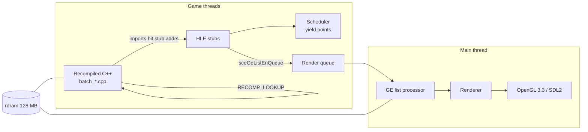

# Architecture

Structural reference for psprecomp. For project status, build instructions, and limitations,
see [README.md](README.md).

## Contents

- [System Overview](#system-overview)
- [Rust Crates](#rust-crates)
- [Generated Output Layout](#generated-output-layout)
- [Per-Game Layer (games/)](#per-game-layer-games)
- [Runtime Subsystems](#runtime-subsystems)
- [Key Data Flow](#key-data-flow)
- [Invariants and Conventions](#invariants-and-conventions)

## System Overview

Two halves: a Rust recompilation pipeline (offline) and a C++17 runtime (online).

1. **Analyze** — Ghidra headless (`analysis/ExtractAnalysis.java`) exports functions, xrefs, and
   mid-function entry points; the Rust ELF parser adds imports (NIDs), relocations, and section
   data. Merged into `analysis.json` (all addresses as hex strings). Relocatable PRX modules
   (`e_type 0xFFA0`) are first rebased to `PSP_USER_MODULE_BASE` (0x08804000; `--load-base`
   to override) with their Type-A relocation tables applied; ET_EXEC binaries load where
   linked and skip every PRX-only step. For **both** formats, analyze emits a `module{}`
   facts block (SceModuleInfo name + gp, entry = load_base + e_entry, text extent per
   PPSSPP `ElfReader` semantics) — the runtime's boot constants flow from it (issue #47
   Phase 2). PRX inputs additionally record `prx{load_base}` provenance.
2. **Recompile** — each guest function is decoded into a typed IR and emitted as a C++ function;
   batches are emitted in parallel (rayon). Output also includes the dispatch table, data
   sections, and mid-entry wrappers.
3. **Run** — the generated code is compiled into the runtime, which supplies guest memory, a
   cooperative scheduler, HLE stubs for the firmware imports, and the GE→OpenGL renderer.

## Rust Crates

All under `crates/`:

| Crate | Responsibility |
|-------|----------------|
| `psp-parser` | ELF/PRX parsing (goblin 0.9.3); PRX loading: segment rebase to `PSP_USER_MODULE_BASE`, section-first Type-A relocation discovery + PPSSPP-faithful application (`reloc.rs`), `LoadedImage` virtual-address view (`image.rs`), SceModuleInfo lookup (`prx.rs`), libstub import walking + NID resolution (`imports.rs`, `nid.rs`) |
| `psp-ir` | `MipsOp` enum, `DecodedFunction` — typed IR for all Allegrex + FPU instructions |
| `psp-decoder` | MIPS32 + Allegrex + FPU instruction decoding, two-pass delay-slot reordering; a branched-into delay slot (BIDS, #56) is fused at the branch (`BranchHazardDelay`) and duplicated at the slot's own position (`DelaySlotRejoin`) so back-edges into the slot keep hardware semantics. VFPU4 (opcode 0x34) dispatches on PPSSPP's 5-bit `tableVFPU4Jump` index (`bits[25:21]`, #27) — the prior 3-bit dispatch mis-decoded the whole `vf2i/vi2f/vcmov/vcst/vsrt/vbfy/vfad/vavg/vwbn` family (e.g. `vcmov`→`vf2iz`), which is what kept Patapon off its real transform path |
| `psp-optimizer` | Peephole passes; all disabled by default (`OptimizerConfig::default()` all false) |
| `psp-emitter` | C++ code generation, batch emission (rayon), dispatch table, generated CMakeLists; a function body whose end is reachable (last op is not an unconditional control transfer — the function-granularity sibling of BIDS) gets an explicit fall-through tail `RECOMP_LOOKUP(end_vaddr); return;` so execution continues into the next function instead of silently returning; mutually exclusive with the reconstructed terminal-`jal` epilogue, which synthesizes the downstream teardown instead |
| `psp-cli` | `psprecomp` binary with `analyze`, `recompile`, `dump` subcommands |

## Generated Output Layout

`psprecomp recompile` writes to `output/` (gitignored; always regenerated, never hand-edited):

| Path | Contents |
|------|----------|
| `generated/batch_*.cpp` | Per-batch function translations |
| `dispatch.cpp` | Address-to-function dispatch table |
| `data_sections.cpp` | `.data`/`.rodata`/`.bss` as byte arrays (addresses masked with `0x07FFFFFFU`) |
| `init_array.cpp` | Static-constructor pointer table (not walked by default — the game's CRT handles it) |
| `mid_entries.cpp` | Mid-function entry point wrappers |
| `syscall_table.cpp` | Generated NID import binding table (issue #40): one `RecompNidStub` row per analysis.json `imports[]` entry (stub address, NID, resolved name, library), sorted by stub address, header stamped with the analysis.json sha256. The runtime's `psp_hle_init()` binds HLE handlers by name at these stub addresses (decls: `runtime/include/hle/psp_hle_imports.h`; emitter: `crates/psp-emitter/src/syscall_table.rs`; recompile **hard-errors** on an empty `imports[]`) |
| `funcs.h` | Forward declarations for all generated functions |
| `include/recomp.h` | `recomp_context` struct, register aliases, memory macros, `RECOMP_LOOKUP` declaration |
| `CMakeLists.txt` | Generated build fragment — globs `batch_*.cpp` only; defines `{module_name}_recomp` plus the stable alias `psp::recomp` |
| `recompile_report.json` | Silent-path audit: counts, decode errors, unresolved NIDs, unhandled relocations, dispatch-target audit, dedup renames (schema in `crates/psp-cli/src/report.rs`; usage in DEBUGGING.md "#37") |
| `fingerprint.json` | Build fingerprint: content hash of the codegen-determining Rust sources + analysis.json hash + `cross_mid` flag + counts. Verified at runtime CMake configure by `runtime/cmake/check_fingerprint.py` — stale output/ fails configure (recipe in `crates/psp-cli/src/fingerprint.rs`; usage in DEBUGGING.md "#36") |
| `include/recomp_fingerprint.h` | Generated header with the fingerprint hash/flag/timestamp; `runtime/src/main.cpp` prints it as the first boot line |
| `include/recomp_module.h` | Generated module facts (issue #47 Phase 2): `RECOMP_MODULE_NAME/ENTRY/GP/TEXT_START/TEXT_SIZE`, `RECOMP_SEG0_VADDR/MEMSZ`, `RECOMP_HEAP_BASE`, `RECOMP_CTOR_COUNT/FIRST_CTOR` — sourced from analysis.json `module{}`; the runtime boot path hard-includes it (emitter: `crates/psp-emitter/src/module_header.rs`; recompile **hard-errors** when analysis.json lacks `module{}` — see DEBUGGING.md "#47 P2") |
| `include/recomp_game_config.h` | Generated per-game choices (issues #46/#47 Phase 4): `RECOMP_GAME_ID`, `RECOMP_BOOT_PATH`, `RECOMP_HEAP_OVERRIDE`, `RECOMP_ASSET_LAYER_BND` — sourced from the `--config` manifest (`games/<id>/game.toml`); generic no-op defaults when recompile ran without `--config`. The runtime guards the include (pre-Phase-4 outputs still build) and never parses TOML (emitter: `crates/psp-emitter/src/game_config_header.rs`) |

Every recompiled function has the signature
`void(uint8_t* rdram, recomp_context* ctx)` (`FuncPtr` in `recomp.h`). The FPU register file in
`recomp_context` exposes `float f[32]` and `uint32_t fi[32]` as aliasing views of the same
storage via an anonymous union.

### Runtime ↔ output contract (issue #47 Phase 1)

The runtime selects its output directory through the CMake cache variable
`PSPRECOMP_OUTPUT_DIR` (default `../output`, validated at configure time alongside the
issue #36 fingerprint check) and links the stable target `psp::recomp` — an ALIAS the
generated `CMakeLists.txt` defines for `{module_name}_recomp`. The runtime therefore
never hardcodes a game's module name or output path; building against another game is
`cmake -B build-<game> -S runtime -DPSPRECOMP_OUTPUT_DIR=/abs/path/<game>_output`.
Runtime hooks that wrap specific guest functions resolve them through the dispatch table
at boot (`RECOMP_LOOKUP` against the pristine table) instead of `extern FUN_*`
declarations, so no game-specific symbols are required at link time.

Per-game boot constants travel the same channel (issue #47 Phase 2): the runtime
hard-includes the generated `recomp_module.h` for the module name/entry/GP, text range,
first load segment, heap base (16 MB-aligned bump-heap start, policy P11; a manifest
`[module] heap_base` pin overrides via `RECOMP_HEAP_OVERRIDE`) and the boot probes —
runtime sources carry no game-specific addresses for these.

## Per-Game Layer (games/)

Issue #46 / #47 Phase 4: a game is described by **facts** (analysis.json → generated
headers, automatic) plus **choices and workarounds** (curated), and the curated layer
lives entirely under `games/<id>/`:

| Artifact | Consumed by | Carries |
|----------|-------------|---------|
| `games/<id>/game.toml` | `psprecomp recompile --config` | `[recompile]` force entries / force mid-entries (replaces the former hardcoded consts), top-level stubs/skips/patches, and `[game]`/`[boot]`/`[module]`/`[runtime]` choices emitted into `recomp_game_config.h` (the runtime never parses TOML) |
| `games/<id>/runtime/*.cpp` | runtime build via `-DPSPRECOMP_GAME=<id>` | Address-keyed dispatch hooks, allocator/CRT override bodies, boot/thread context tweaks, asset layer, IO policy, LOOKUP_MISS handler, GE vertex fallback — everything title-specific that is code, not data (Patapon: `hooks_main/_memory/_thread/_dispatch/_io/_ge.cpp` + `asset_bnd.cpp/.h`; private decls in `patapon_hooks.h`) |
| `games/<id>/tests/`, `games/<id>/scripts/` | manual / CI | Game-coupled unit tests (`test_asset_bnd`, built only under `-DPSPRECOMP_GAME=patapon`) and acceptance scripts (`test_phase11_*.sh`) |

The seam is `PspGameModule` (`runtime/include/psp_game_module.h`): one struct of
registration hooks (`register_hooks` after `psp_hle_init()`, `on_boot_context` just
before `entry()`, `on_thread_start` after each thread's k0 block is built). Exactly one
translation unit provides the strong `psp_game_module()` definition: the selected game
module, or `runtime/src/psp_game_default.cpp` (no-op module, id `""`) when
`-DPSPRECOMP_GAME=none`. Selection is compile-time (CMake glob of
`games/<id>/runtime/*.cpp` with `CONFIGURE_DEPENDS`) — no plugin machinery, and a
generic build verifiably contains zero game symbols (`nm | grep`). The default is
`patapon` so the documented build commands keep working unchanged; at boot the runtime
warns loudly when the compiled-in module id differs from the output dir's
`RECOMP_GAME_ID`. Reasoning: bring-up of a second game must not inherit Patapon's patch
stack, and a fix that only works for one title belongs in its module, never in core.

Beyond the `PspGameModule` boot hooks, the core exposes narrow installer seams a game
module may use from `register_hooks` (issue #47 Phase 5 — each replaced formerly inline
Patapon code; all default to no-op when uninstalled):

| Seam | Header | Generic default |
|------|--------|-----------------|
| `psp_kmem_set_partition_alloc_observer` / `psp_kmem_bump_alloc` / `psp_kmem_reserve_remaining` | `hle/psp_hle.h` | Bump heap untouched by games except through these |
| `psp_dispatch_set_miss_handler` | `hle/psp_hle.h` | Miss = log + `v0 = 0` noop stub |
| `psp_kernel_set_callback_dispatch_observer` | `hle/psp_hle_kernel.h` | No per-callback diagnostics |
| `psp_io_set_policy` (`PspIoPolicy`) | `hle/psp_hle_io.h` | No archive reroute / slot staging / artifact filter; slice-fd mechanics stay in core |
| `ge_vertex_set_degenerate_fallback` | `psp_ge_vertex.h` | World-space passthrough + one-time warn |

The degenerate-matrix fallback fires on three triggers, all computed generically in
core (no game constants): an all-zero view matrix, a non-finite/diagonal-degenerate
projection, and — added in #23 — a *collapsed composed MVP* (`ge_mvp_collapses` in
`psp_ge_vertex.cpp`), which transforms the prim's vertices and flags it when a
meaningfully-spread model footprint crushes to a sub-pixel NDC sliver (absolute *and*
relative thresholds must both hold, so legitimately-small geometry is never mis-flagged).
The collapse detector is a **temporary mask** over the still-open guest-matrix dataflow
bug (#67): the guest-uploaded matrices now arrive non-zero but numerically broken, so the
older gates miss them while the screen goes black. It keeps Patapon's visible output
correct until the matrices are root-fixed; its removal criterion is that fix landing.

The quarantine is enforced mechanically by `runtime/tools/purity_gate.sh` (see
DEBUGGING.md §2): no non-allowlisted `0x08xxxxxx`/`0x09xxxxxx` literal in
`runtime/src` + `runtime/include`, and no game symbol (defined or undefined) in any
core object file of a build.

Zero-manifest defaults: no `--config` ⇒ no force entries, generic boot path, heap from
the `RECOMP_HEAP_BASE` align policy, no asset layer; `-DPSPRECOMP_GAME=none` ⇒ no hooks.
A well-behaved game boots this way — the manifest exists for curation, not table stakes.

## Runtime Subsystems

All under `runtime/` (headers in `runtime/include/`, sources in `runtime/src/`):

| Subsystem | Files | Responsibility |
|-----------|-------|----------------|
| Boot / main loop | `main.cpp` | Generic boot sequence (module start, thread creation), SDL2 main loop — contains zero address-keyed hooks (they live in `games/<id>/runtime/`, Phase 4) |
| Game modules | `psp_game_module.h`, `psp_game_default.cpp`, `games/<id>/runtime/` | Per-game hook seam — see [Per-Game Layer](#per-game-layer-games) |
| Memory | `psp_memory.cpp` | 128 MB `rdram` allocation; all guest addresses masked with `0x07FFFFFFU` |
| Dispatch | `psp_dispatch.cpp` | `RECOMP_LOOKUP` address→function resolution; miss handler; `PSPRECOMP_STRICT` abort mode |
| Scheduler | `psp_scheduler.cpp` | Cooperative threading (`PspThread`, yield points); `thread_local PspThread* g_current` |
| HLE | `src/hle/psp_hle_*.cpp` | Firmware NID implementations: io, kernel (thread/sema/mutex/lwmutex/eventflag/memory), display, ge, ctrl, power, utility; name-based registration wired to the generated `syscall_table.cpp` stub addresses via dispatch overrides (issue #40 — no per-game stub addresses in the runtime; unbound stubs get a loud per-NID unimplemented no-op that returns a deterministic `v0 = 0`; NID→stub lookup for runtime code via `psp_hle_stub_addr_for_nid`) |
| GE list processor | `psp_ge.cpp` | Display-list interpretation, including SIGNAL flow-control behaviors 0x10–0x12 (JUMP/CALL/RET) |
| Renderer | `psp_ge_draw.cpp`, `psp_ge_vertex.cpp`, `psp_ge_viewport.cpp`, `psp_ge_texture.cpp`, `psp_ge_shader.cpp` | Vertex decode/transform (column-major PSP matrices), CLUT/texture decode, shaders, GL draw; `psp_ge_viewport.cpp` (`ge_compute_viewport_depth`, #23) maps PSP viewport scale/offset → `glViewport` and the reversed-Z depth range → `glDepthRange` (replacing the old hardcoded `glViewport(0,0,480,272)`) — deep-dive in [docs/GRAPHICS.md](docs/GRAPHICS.md) |
| Render queue | `psp_render_queue.cpp` | Condvar request queue — the only path by which GL work reaches the main thread |
| Event loop | `psp_event_loop.cpp` | SDL2 event pump, quit handling, render-queue drain |
| VFPU | `psp_vfpu_*.cpp` | VFPU instruction implementations (arith, convert, matrix, mem, trig, misc); S/T prefixes initialize to identity (`0xE4`) on context creation (#27 — a `memset(0)` context would otherwise apply a non-identity prefix to the first VFPU op) |
| Asset/BND | `games/patapon/runtime/asset_bnd.cpp` | Patapon BND archive parsing (`DATA_CMN.BND`) — lives wholly in the Patapon game module (#47 Phase 5), reached from core only through the `PspIoPolicy` seam; arena constants in `games/patapon/runtime/asset_bnd.h` |
| Debug socket | `psp_debug_socket.cpp` | TCP server on port 9999, multiple concurrent clients, OK/ERR-framed line protocol: memory read/write, runtime-info JSON, button injection, screenshots (serviced by the render thread). Protocol reference: DEBUGGING.md §6 |

## Key Data Flow

- Guest code calls firmware imports through stub addresses in the binary; the dispatch table
  overrides those addresses with HLE functions.
- GE display lists are submitted by HLE (`sceGeListEnQueue`) and executed on the main thread via
  the render queue — game threads never call GL directly (macOS requirement).
- Mid-function entries (jump targets inside a function, e.g. from vtables or cross-function
  branches) are handled by wrappers that set `ctx->entry_point`; the parent function's entry
  switch dispatches to the matching label and clears the field before the goto.

## Invariants and Conventions

These are load-bearing; violating them causes real bugs.

1. `rdram` is **not** a `recomp_context` field — it is a separate function parameter
   (thread-safety: each game thread has its own context but shares memory).
2. All guest memory accesses mask addresses with `0x07FFFFFFU` (128 MB space).
3. GL calls only ever happen on the main thread via the render queue.
4. Cross-function branches use `RECOMP_LOOKUP`, never `goto` (C++ goto cannot cross function
   boundaries). Branch/jump IR stores absolute u32 target addresses, not raw offsets.
5. The generated CMakeLists globs `batch_*.cpp` only — never `generated/*.cpp` (stale duplicates
   cause linker errors).
6. Never edit `output/generated/*.cpp` by hand — fix the emitter and regenerate.
7. Duplicate function names are deduplicated with `_ADDR` hex suffixes (ODR safety); the module
   start function is named `entry`.
8. Float registers are written as `ctx->f[N]` (array notation); the `f[]`/`fi[]` union keeps
   integer and float views coherent.
9. Decode errors emit empty stubs with error comments rather than aborting the pipeline.
10. Optimizer passes stay disabled until the project's correctness bar is met.
11. `PSPRECOMP_CROSS_MID=1` enables cross-function mid-jump injection in the recompiler
    (`crates/psp-cli/src/recompile.rs`); the project's standard workflow sets it for both the
    recompile step and runtime runs.
12. The canonical binary image is psp-parser's rebased + relocated `analysis.json segments[]`
    (`data_b64`) — everything downstream (recompile byte slicing, binary scans, data sections,
    the runtime) consumes only it. Ghidra is an *analysis oracle* (functions/xrefs/constructors),
    never a byte source: for relocatable modules its feed is pinned
    (`-loader PspElfLoader -loader-imagebase <hex>`), and a mandatory byte-equality gate
    (per-block SHA-256 from `ExtractAnalysis.java`, recomputed in analyze over the relocated
    segments) hard-fails the run if the two relocation engines (`reloc.rs` vs ghidra-allegrex)
    ever diverge. Reasoning: two independent relocation engines exist by design — the gate makes
    drift loud at analyze time instead of surfacing as translation bugs. The
    `<output>.ghidra_raw.meta.json` sidecar (binary hash, loader, imagebase) prevents a stale
    base-0 Ghidra cache from being silently reused. Details: DEBUGGING.md "#52".
