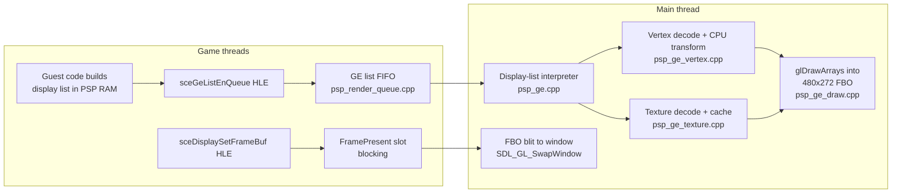

# Graphics: PSP GE to OpenGL 3.3

How the runtime translates the PSP Graphics Engine (GE) into OpenGL 3.3 under SDL2. This is a
deep-dive companion to [ARCHITECTURE.md](../ARCHITECTURE.md); everything described here is the
behavior of the code as written, including its approximations and known gaps.

## Contents

- [Overview](#overview)
- [Display-List Interpretation](#display-list-interpretation)
- [Vertex Pipeline](#vertex-pipeline)
- [Texture Pipeline](#texture-pipeline)
- [Raster State Mapping](#raster-state-mapping)
- [Threading and Present](#threading-and-present)
- [What Is Not Implemented](#what-is-not-implemented)
- [Debugging Hooks](#debugging-hooks)

## Overview

The PSP's GE is a command-stream GPU: the game writes a *display list* (a sequence of 32-bit
command words) into PSP RAM and submits it with `sceGeListEnQueue`. The runtime replaces the
hardware with a software interpreter (`runtime/src/psp_ge.cpp`) that walks the list on the main
thread, tracks GE register state, and turns `PRIM` commands into `glDrawArrays` calls against a
480x272 offscreen FBO. Vertex transform happens entirely on the CPU; the GL shader is a fixed
pass-through "uber-shader". Presenting a frame blits the FBO to the window and swaps.

Key files:

| File | Role |
|------|------|
| `runtime/src/psp_ge.cpp` | Display-list interpreter and `GeState` state machine |
| `runtime/src/psp_ge_vertex.cpp` | Vertex format decode and CPU transform to NDC |
| `runtime/src/psp_ge_texture.cpp` | Texture/CLUT decode, swizzle, texture cache |
| `runtime/src/psp_ge_draw.cpp` | FBO, VBO upload, GL state mapping, draw, present |
| `runtime/src/psp_ge_shader.cpp` | The single GLSL 330 shader pair |
| `runtime/src/psp_render_queue.cpp` | Cross-thread queue; the only path to GL |
| `runtime/src/hle/psp_hle_ge.cpp` | `sceGe*` HLE entry points |
| `runtime/src/hle/psp_hle_display.cpp` | `sceDisplay*` HLE entry points |
| `runtime/include/psp_ge_constants.h` | Command IDs, VTYPE fields, format enums (derived from PPSSPP) |

## Display-List Interpretation

### Command format

Each display-list word is `[31:24] = command, [23:0] = data`. Float-valued commands (matrices,
viewport, texture scale) encode the *upper 24 bits* of an IEEE 754 float; the interpreter
reconstructs the value as `data << 8` reinterpreted as float (`data_to_float`).

`ge_process_display_list(rdram, list_addr, stall_addr)` is a fetch/decode/execute loop over a
single `GeState` instance (a global; there is one GE, mirroring the hardware). Most commands
just store their data into a `GeState` field — addresses, the VTYPE bitfield, matrices, texture
registers, enables, blend/depth/cull words. The interesting ones are below. A safety valve
(`GE_MAX_COMMANDS` = 4M commands) stops runaway lists, and unknown commands warn once per
command ID (`cmd_warned[256]`).

### Addressing

`BASE` (0x10) stores `(data << 8) & 0xFF000000`; 24-bit address fields in `VADDR`, `IADDR`,
`JUMP`, and `CALL` are resolved as `base_addr | (data & 0x00FFFFFF)`. `OFFSETADDR` and `ORIGIN`
update `offset_addr` (saved/restored across calls, but not otherwise applied to address
resolution in this implementation).

### Flow control

- **JUMP** (0x08): `pc = resolve_addr(data & ~3)`.
- **CALL** (0x0A): pushes `{return pc, offset_addr, base_addr}` onto a 32-entry call stack
  (`GE_CALL_STACK_SIZE`), then jumps. Overflow stops processing and parks the list as stalled
  (it stays in the queue and never completes).
- **RET** (0x0B): pops and restores `offset_addr`/`base_addr`. Underflow parks the list as
  stalled, like CALL overflow.
- **BJUMP** (0x09, bounding-box conditional jump): treated as a no-op — the jump is never
  taken, so everything is conservatively processed.
- **END** (0x0C): terminates the list, returns `completed = true`, and — if the list drew at
  least one PRIM — auto-presents the frame (`ge_present_frame`) so rendered content becomes
  visible even when the game does not call `sceDisplaySetFrameBuf` again immediately.
- **FINISH** (0x0F): does *not* end the list. It fires the registered GE finish callback (from
  `sceGeSetCallback`) synchronously: the handler is resolved with `RECOMP_LOOKUP` and invoked
  with `a0 = data & 0xFFFF` (the token the game embedded in the list), `a1 = finish_arg`, and
  `sp` pointing at a lazily-carved 4 KB guest stack — GE callbacks run real recompiled guest
  code that pushes stack frames, so a zero `sp` would corrupt low memory.

### SIGNAL (0x0E) — including flow-control behaviors

`SIGNAL`'s data is `[23:16] = behavior, [15:0] = signal value`. Behaviors 0x10–0x12 are GE
*flow control*, matching PPSSPP's `GPUCommon::ProcessSignal`:

- **0x10 JUMP / 0x11 CALL**: the SIGNAL pairs with the *following* `END` word. The 32-bit
  target is `(signal_value << 16) | (END data & 0xFFFF)`, masked with `0xFFFFFFFC` (bits 28–31
  are kept so uncached-space PCs still compare correctly against the stall address). The paired
  END is consumed — it is **not** a list end. CALL pushes onto the same call stack as
  `GE_CMD_CALL`; on stack overflow the call is skipped (PPSSPP parity) rather than parking the
  list.
- **0x12 RET**: pops the call stack; with an empty stack it skips the paired END and continues.

This matters for Patapon specifically: the game keeps essentially all real geometry in
SIGNAL-called sub-lists. Before these behaviors were implemented, every sub-list was skipped
and the title screen was empty.

Any other behavior falls through to the *user signal callback* path: the handler registered by
`sceGeSetCallback` is invoked like the FINISH callback (`a0 = data & 0xFFFF`,
`a1 = signal_arg`, carved guest stack). The suspend/continue behavior distinctions (0x01–0x03)
and the relative/offset flow-control variants (0x13–0x18) are not implemented.

### Stall address and list lifecycle

The stall address implements the PSP's producer/consumer protocol: the game enqueues a list
whose tail it is still writing, with `stall_addr` marking the write frontier. Before each
fetch, the interpreter checks `pc >= stall_addr` (when `stall_addr != 0`) and, if hit, returns
a *stalled* result with the current PC. The list stays in the queue; when the game calls
`sceGeListUpdateStallAddr`, the queue entry's stall address is advanced, the `stalled` flag is
cleared, and processing later resumes from the saved PC.

### List enqueue from HLE

`hle_sceGeListEnQueue` (`runtime/src/hle/psp_hle_ge.cpp`) pushes
`{uid, list_addr, stall_addr, current_pc}` onto the GE FIFO and returns the UID immediately —
the game thread does not wait for rendering. UIDs are 1-based because PPSSPP returns 1-based GE
list IDs and the game passes the UID back to `UpdateStallAddr` (a 0 UID caused mismatches).
`sceGeListEnQueueHead` is treated identically (no priority semantics). `sceGeDrawSync` and
`sceGeListSync` both map to `render_queue_draw_sync` (per-list sync is not tracked):
mode 0 blocks until the FIFO drains, with a 500 ms timeout safety valve against lost lists;
mode 1 polls. `sceGeSetCallback` reads the 4-word `sceGeCallbackData` struct from guest memory,
registers the signal/finish handlers, and also calls the guest's
`sceKernelRegisterSubIntrHandler`/`EnableSubIntr` shims so the observable boot sequence stays
in lock-step with PPSSPP. `sceGeEdramGetAddr`/`GetSize` return `0x04000000` / 2 MB.

## Vertex Pipeline

### Vertex formats

`GE_CMD_VERTEXTYPE` stores the raw VTYPE bitfield; `psp_ge_vertex.cpp` decodes all of it:

| Component | Widths | Normalization |
|-----------|--------|---------------|
| Texcoord (TC) | u8, s16, float | u8 / 128, s16 / 32768, float as-is |
| Color (COL) | 565, 5551, 4444, 8888 | expanded to RGBA8 (5551 alpha is 0 or 255) |
| Normal (NRM) | s8, s16, float | s8 / 127, s16 / 32767 |
| Position (POS) | s8, s16, float | raw values (no scaling) |
| Index (IDX) | u8, u16, u32 | read from `IADDR` |
| Weights | u8, u16, float, count 1–8 | **stride accounted for, data skipped** (no skinning) |

`ge_vertex_stride` reproduces the PSP's packing rules, including alignment: 16-bit components
align the running offset to 2, float components to 4, and the total stride is padded to the
alignment of the largest component. Indexed draws read the index buffer first and then address
`vertex_addr + index * stride`; non-indexed draws are sequential.

### Through mode vs. transform mode

Bit 23 of VTYPE selects *through mode* (pre-transformed screen coordinates). Through-mode
vertices are mapped directly to NDC for the 480x272 screen:
`x/240 - 1`, `1 - y/136`, `z/65535`.

Transform mode runs the standard PSP chain on the CPU: model → world → view → projection.
World/view are 4x3 matrices, projection is 4x4, all uploaded **column-major** via the
`*MATRIXNUMBER`/`*MATRIXDATA` command pairs — the transform helpers match PPSSPP's
`Vec3ByMatrix43`/`Vec3ByMatrix44` exactly (translation lives at flat indices 9/10/11 of the
4x3). An earlier row-major interpretation of the same data collapsed every vertex to a single
point; the column-major convention is load-bearing. After projection, a perspective divide by
`clip.w` produces NDC (skipped when `|w| < 1e-6`).

After projection produces NDC, transform-mode draws map through the PSP viewport registers
(`VIEWPORTXSCALE/YSCALE/XCENTER/YCENTER`) and screen offset (`OFFSETX`/`OFFSETY`, 1/16
subpixel) to `glViewport`, and the depth range (`VIEWPORTZSCALE/ZCENTER`) to `glDepthRange`
(`ge_compute_viewport_depth` in `psp_ge_viewport.cpp`, applied per-PRIM in `ge_draw_prim`,
issue #23). The mapping mirrors PPSSPP's `ConvertViewportAndScissor` for the 1:1, non-accurate
-depth FBO: `left = vpXCenter - offsetX - |vpXScale|`, `w = |2·vpXScale|` (PSP top-left flipped
to GL bottom-left), depth `[(vpZCenter-vpZScale), (vpZCenter+vpZScale)]/65535`. For a full-screen
viewport this reduces to the previous `glViewport(0,0,480,272)`. Through-mode (2D/sprite) draws
already bake the full-screen 240/136 mapping into NDC, so they keep the full-buffer viewport and
an identity depth range. (`MINZ`/`MAXZ` are now stored in `GeState` but the active depth range
uses the viewport Z registers, per PPSSPP's non-accurate-depth path.)

In both modes, UVs are post-processed with `TEXSCALEU/V` and `TEXOFFSETU/V`.

### Temporary degenerate-matrix fallbacks

> **Temporary.** Two fallbacks in `ge_transform_vertices` compensate for a known open
> guest-side bug: recompiled FPU/VFPU code currently computes broken view/projection matrices
> (the view arrives all-zero; the projection arrives NaN/Inf or with a collapsed X/Y diagonal).
> They must be removed once the guest uploads sane matrices — the second one hardcodes
> Patapon's viewport and produces no depth ordering, so it cannot survive into 3D gameplay.

1. **All-zero view → identity.** If every element of the view matrix is zero, the view
   transform is skipped (world space is used as view space).
2. **Degenerate projection → Patapon-specific ortho.** If any projection element is non-finite
   or `|m[0]|`/`|m[5]|` < 1e-6, the projection is bypassed and NDC is emitted directly from
   *world* space as `x/240 - 1`, `y/136 + 1`, `z = 0`. This is the ortho mapping Patapon's
   title screen intends (viewport scale 240/-136, center 2048), so 2D menus render correctly,
   but it is not a general projection.

Both fallbacks log once (`view matrix all-zero -- identity fallback engaged` /
`proj matrix degenerate -- NDC-direct fallback engaged`), so their engagement is visible in any
run log.

## Texture Pipeline

### Texture addressing and formats

Texturing uses mip level 0 only: `TEXADDR0` supplies the low 24 address bits and bits [23:16]
of `TEXBUFWIDTH0` supply address bits [31:24]. Width/height come from `TEXSIZE0` as
`1 << log2`. Supported formats, all converted to RGBA8 for GL:

| GE format | Decode |
|-----------|--------|
| 5650 / 5551 / 4444 | 16-bit channel expansion (5551: 1-bit alpha → 0 or 255) |
| 8888 | memcpy |
| CLUT4 | each nibble indexes the palette (low nibble = even pixel) |
| CLUT8 | each byte indexes the palette |
| CLUT16/32, DXT1/3/5 | **not implemented** — filled with opaque magenta |

### CLUT mechanics

The palette address combines two registers: `CLUTADDR` holds the low 24 bits and
`CLUTADDRUPPER`'s data word is shifted left 8 to form bits 24–27
(`(clut_addr & 0xFFFFFF) | ((clut_addr_upper << 8) & 0x0F000000)`), matching PPSSPP. Getting
this upper-bits encoding wrong is what previously made all CLUT texels transparent — the
palette was being read from zeroed RAM.

`CLUTFORMAT` selects the palette entry format (5650/5551/4444/8888, all expanded to RGBA8; 256
entries are always read). The shift/mask/start fields of `CLUTFORMAT` are parsed but
deliberately unused (explicit `(void)` casts) — index remapping is not implemented.
`LOADCLUT` is a no-op; the palette is re-read from guest memory at every texture decode, so
"load" timing is subsumed by the content-hash cache check below.

### Swizzle

When `TEXMODE` bit 0 is set, texture data is stored in the PSP's tiled ("swizzled") layout:
16-byte-wide by 8-row-tall tiles. `unswizzle_texture` linearizes it before format conversion.
Unswizzle is only applied when `width_bytes >= 16 && height >= 8`; smaller textures are used
as-is.

### Texture cache

A fixed 256-entry cache (`TexCacheEntry`, `psp_ge_texture.h`) keyed by
**(psp_addr, content_hash)** where the hash is FNV-1a over the first `min(size, 4096)` bytes of
the texture data in guest memory. On every `ge_texture_bind`:

1. The hash is recomputed from current guest memory (so CPU writes to a texture naturally miss
   the stale entry — there is no explicit invalidation protocol).
2. Exact (addr, hash) match → bind cached GL texture, refresh its `last_frame`.
3. Otherwise an empty slot is used, or the least-recently-used entry (smallest `last_frame`) is
   evicted and its GL texture deleted; the texture is then decoded and uploaded with
   `glTexImage2D(GL_RGBA8, ...)`.

Sampler state is fixed: `GL_NEAREST` min/mag filter and `GL_CLAMP_TO_EDGE` wrap, regardless of
the game's `TEXFILTER`/`TEXWRAP` registers (which are stored but unused). The CLUT contents are
*not* part of the cache key — a palette swap over identical texel data will incorrectly hit the
old cache entry.

## Raster State Mapping

`ge_draw_prim` sets GL state per draw call. PSP → GL mapping as implemented:

| PSP state | GL translation | Notes |
|-----------|---------------|-------|
| `ALPHABLENDENABLE` + `BLENDMODE` | `glBlendFunc` + `glBlendEquation` | Factors map 1:1 where GL has an equivalent; the `DOUBLE*` (2x) factors degrade to their non-doubled forms; `ABSDIFF` degrades to `GL_FUNC_ADD` |
| `BLENDFIXEDA` | `glBlendColor(r,g,b,1.0)` when src factor = FIXA | FIXB also maps to `GL_CONSTANT_COLOR` but its constant is never uploaded — GL has a single blend color, FIXA wins |
| `ALPHATESTENABLE` + `ALPHATEST` | fragment-shader compare + `discard` | func = bits [2:0], ref = bits [15:8]/255; the AND-mask byte is ignored |
| `ZTESTENABLE` + `ZTEST` | `glEnable(GL_DEPTH_TEST)` + `glDepthFunc` | All 8 compare funcs map directly |
| `ZWRITEDISABLE` | `glDepthMask` | |
| `CULLFACEENABLE` + `CULL` | `glEnable(GL_CULL_FACE)`; 0 → `GL_BACK`, 1 → `GL_FRONT` | PSP cull is winding-order based; this fixed-face mapping is an approximation |
| `TEXFUNC` | fragment-shader branch | MODULATE / DECAL / REPLACE / ADD; BLEND is simplified (the texture environment color is not used) |
| `SHADEMODE` | none | tracked; GL 3.3 core is always smooth-shaded |
| Stencil, scissor, region, color test, logic op, dither, RGB/alpha masks, MINZ/MAXZ, fog | none | registers tracked (or ignored); no GL calls are emitted |

### Clear mode

The PSP has no clear command; games clear by drawing a full-screen rectangle with
`CLEARMODE` enabled. The runtime translates this specially: when `clear_mode` is set, the PRIM
is not drawn — instead the first vertex is decoded for its color, and `glClear` is issued with
buffers selected by the clear flags (bit 0 → color, bit 1 → stencil, bit 2 → depth; if no flags
are set, color+depth). Two quirks of this translation: the clear always covers the whole FBO
(the rectangle's actual extent is ignored), and the depth mask is forced on for the clear.

### Primitives

`PRIM`'s data is `[18:16] = type, [15:0] = count`. POINTS/LINES/LINE_STRIP/TRIANGLES/
TRIANGLE_STRIP/TRIANGLE_FAN map directly to their GL equivalents. **RECTANGLES** (PSP sprites,
type 6) have no GL analog: each pair of vertices (top-left, bottom-right) is expanded on the
CPU into two triangles (6 vertices), synthesizing the other two corners from the pair's
coordinates and UVs.

Draws go through one streaming VBO: vertices are packed into a 24-byte layout (3 floats
position, 2 floats UV, 4 bytes color), uploaded with `GL_STREAM_DRAW`, and rendered with a
single `glDrawArrays` per PRIM command. There is no batching across PRIMs. The vertex shader is
a pure pass-through (`gl_Position = vec4(a_position, 1.0)`) because all transformation already
happened on the CPU.

The render target is a 480x272 RGBA8 FBO with a 24-bit depth renderbuffer, created once at
startup (`ge_draw_init`); `ge_draw_begin_list` binds it and sets a full-buffer default viewport
at the start of every list. The precise per-draw viewport and depth range are applied in
`ge_draw_prim` from the live PSP viewport/depth registers (issue #23), since those registers may
be set after `begin_list`.

## Threading and Present

### Why all GL is on the main thread

Game threads are OS threads running recompiled guest code; on macOS, GL calls must come from
the thread that owns the context. The render queue (`psp_render_queue.cpp`) is therefore the
*only* path by which graphics work reaches GL — this is invariant #3 in ARCHITECTURE.md. The
SDL window and GL 3.3 core context are created on the main thread at boot
(`psp_runtime_init_sdl` in `psp_event_loop.cpp`: SDL video init, context attributes 3.3 core +
double buffer, 480x272 window, `SDL_GL_CreateContext`, then
`gladLoadGL((GLADloadfunc)SDL_GL_GetProcAddress)`), followed by `ge_init`, `ge_draw_init`, and
`ge_texture_init` (`main.cpp`).

### Queue protocol

One mutex + condvars guard two independent paths:

1. **Blocking single-slot path (`render_queue_post`)** — used by `sceDisplaySetFrameBuf`'s
   `FramePresent` request. The game thread writes the global request slot, notifies, and waits
   on the condvar until the main thread marks it done (or `g_should_exit` is set; there is
   deliberately no timeout — the game thread must block until GL work completes).
2. **Non-blocking GE FIFO (`render_queue_enqueue_ge_list`)** — `sceGeListEnQueue` appends a
   `GePendingList` and returns immediately with the UID. `sceGeListUpdateStallAddr` mutates the
   entry in place and clears its `stalled` flag.

The main thread runs `psp_event_loop`: pump SDL events (quit handling), call
`render_queue_process()`, and sleep 1 ms — the sleep is skipped while GE lists are pending so
they drain faster. `render_queue_process` first services a pending FramePresent, then snapshots
all non-stalled FIFO entries, **releases the lock during list interpretation** (so game threads
are not blocked behind GL work), and re-acquires it to write back results: completed lists are
removed, stalled lists stay with their saved PC. When the queue empties, `g_ge_done_cv` wakes
any thread blocked in `render_queue_draw_sync`. The finish callback is *not* fired at
queue-drain time — it fires per-list at the FINISH command, as on hardware (firing it again at
drain time was a real double-fire bug, issue #10).

When all game threads exit, the event loop lingers 3 seconds (still draining the queue) so
final frames are flushed before shutdown.

### Present

`ge_present_frame` is reached two ways: a `FramePresent` request from `sceDisplaySetFrameBuf`,
or the auto-present at a display list's END when the list drew PRIMs. Either way it blits the
480x272 FBO to the default framebuffer (`glBlitFramebuffer`, scaled to the current window size,
`GL_NEAREST`) and calls `SDL_GL_SwapWindow`.

Two consequences of how this is implemented:

- The `fb_addr`/`fb_stride`/`fb_format` arguments are accepted and ignored — present never
  reads the guest framebuffer in PSP VRAM. Anything the CPU draws directly into the
  framebuffer (software rendering, `sceGeEdram` writes) is invisible; only GE-rendered FBO
  content is shown. Double-buffer flips via `sceDisplaySetFrameBuf` all present the same FBO.
- Frame pacing is driven by the *guest*, not the renderer: `sceDisplayWaitVblankStart` sleeps
  16.667 ms on the game thread to simulate the 60 Hz vblank. No `SDL_GL_SetSwapInterval` is
  called, so vsync is whatever the platform defaults to.

## What Is Not Implemented

Honest inventory of GE features the interpreter accepts but does not execute, with the
consequence of each. "Tracked" means the register value is stored in `GeState`.

| Feature | Status | Consequence |
|---------|--------|-------------|
| SIGNAL behaviors 0x13–0x18 (relative/offset jump/call/ret) | fall through to the user-callback path | a game using them would corrupt list flow; Patapon uses 0x10–0x12 only |
| SIGNAL suspend/continue semantics (0x01–0x03) | treated as plain callback signals | no list pause/resume semantics |
| Lighting (all `LIGHT*` commands, light enables, `LIGHTMODE`) | ignored | vertex colors pass through unlit; lit 3D scenes will look wrong |
| Texture matrix (`TGENMATRIX*`, `TEXMAPMODE`, `TEXSHADELS`) | matrix stored, never applied | UV generation modes (env mapping etc.) render with raw UVs |
| Bone matrices / skinning, morph weights | weights skipped in vertex decode (stride only) | skinned meshes render in bind pose at best |
| Bezier/spline patches (`BEZIER`, `SPLINE`, `PATCH*`) | ignored | curved-surface geometry never drawn |
| Block transfers (`TRANSFERSTART` + src/dst regs) | ignored | GE-side memory copies (e.g. VRAM uploads, image blits) silently do nothing |
| `BJUMP` (bounding-box conditional jump) | never jumps | conservative: everything is processed, minor overdraw |
| `bufw != width` textures | `bufw` parsed then unused; rows assumed contiguous at `width` | textures whose buffer stride differs from their width decode sheared |
| CLUT shift/mask/start, CLUT16/CLUT32, DXT1/3/5 | shift/mask/start parsed and discarded; formats render magenta | palette index remapping breaks; unsupported formats are visually loud |
| Mipmaps (levels 1–7) | only `TEXADDR0`/`TEXSIZE0` used | no minification chain; just level 0 with NEAREST |
| `TEXFILTER` / `TEXWRAP` | tracked, sampler fixed at NEAREST + CLAMP_TO_EDGE | no bilinear filtering, no UV repeat/mirror |
| Stencil (`STENCILTEST`/`STENCILOP`) | tracked, no GL stencil calls | stencil-masked effects missing; FBO has no stencil attachment |
| Scissor / region / screen offset | tracked, never applied | draws are never clipped to sub-rectangles |
| Viewport registers (transform mode) | **applied** — scale/offset → `glViewport`, Z scale/center → `glDepthRange` (`ge_compute_viewport_depth`, issue #23) | transformed geometry lands at the correct screen position and depth; through-mode 2D still uses the baked full-screen NDC mapping |
| Color test, logic op, dither, `MASKRGB`/`MASKALPHA` | ignored | corresponding per-fragment effects missing |
| `MINZ`/`MAXZ` (depth-range clamp) | stored; active depth range derived from viewport Z (PPSSPP non-accurate-depth path) | per-fragment depth clamp not applied |
| Fog (`FOG1`/`FOG2` ignored; color stored) | no shader fog | fogged scenes render unfogged |
| `DOUBLE*` blend factors, `ABSDIFF` blend op, FIXB blend constant | approximated (see raster table) | subtle blending differences vs. hardware |
| Clear-mode rectangle extent | full-buffer `glClear` | partial clears clear the whole screen |
| `sceGeGetCmd` | returns 0 | games introspecting GE state get nothing |
| `sceGeListEnQueueHead` priority, per-list `sceGeListSync` | mapped to plain enqueue / all-lists sync | ordering/sync fidelity reduced; safe for single-producer use |

## Debugging Hooks

All GE debug switches are environment variables read at startup; diagnostics go to stderr.

| Hook | Effect |
|------|--------|
| `PSPRECOMP_GE_TRACE=1` | Per-command trace from the interpreter: `[GE:0xPC] cmd=0xNN data=0xNNNNNN`, plus SIGNAL/CALL/RET/END/stall events. Very verbose. |
| `PSPRECOMP_SCREENSHOT=/path.tga` | Writes one TGA of the FBO at the first present after any PRIM (including clear-mode) has been drawn. Without it, a final `frame.tga` is auto-captured at shutdown if anything was drawn. |
| `PSPRECOMP_GE_TEST=1` / `PSPRECOMP_GE_TEST_ONLY=1` | Runs the synthetic renderer self-test (`psp_ge_test.cpp`) after GL init; `_ONLY` captures the test frame and exits before the game thread starts — verifies the GL side independently of game asset loading. |
| `PSPRECOMP_GEOM_SELFTEST=1` | Injects one synthetic non-sprite draw through the PRIM counters, proving the GRAPHICS/NO-GRAPHICS verdict logic is not a constant-false oracle. |

Always-on instrumentation in `ge_draw_prim` / `psp_ge.cpp` (no env var needed):

- `[DRAW_PRIM]` — rate-limited per-draw log (first 50, every 25th, first 5 non-clear).
- `[GE_GEOM_HEARTBEAT]` — every 256 PRIMs, a flushed tally of real (non-sprite, non-clear) vs.
  sprite vs. clear draws; survives kills and hangs, unlike atexit output.
- `[GE_GEOM_REAL_DRAW]` — printed once at the first real geometry draw.
- `[GE_SUMMARY]` / `[GE_PRIM_DETAIL]` / `[GE_GEOM_VERDICT]` — atexit totals: lists processed,
  PRIMs by (type, clear) bucket, and a one-line GRAPHICS/NO-GRAPHICS verdict consumed by the
  verification harness.

For live inspection of display-list memory and GE-adjacent guest structures, the runtime's TCP
debug socket on port 9999 (live memory inspection) works while the game runs; PPSSPP serves as the
behavioral oracle for diffing (see README, Verification Methodology).
